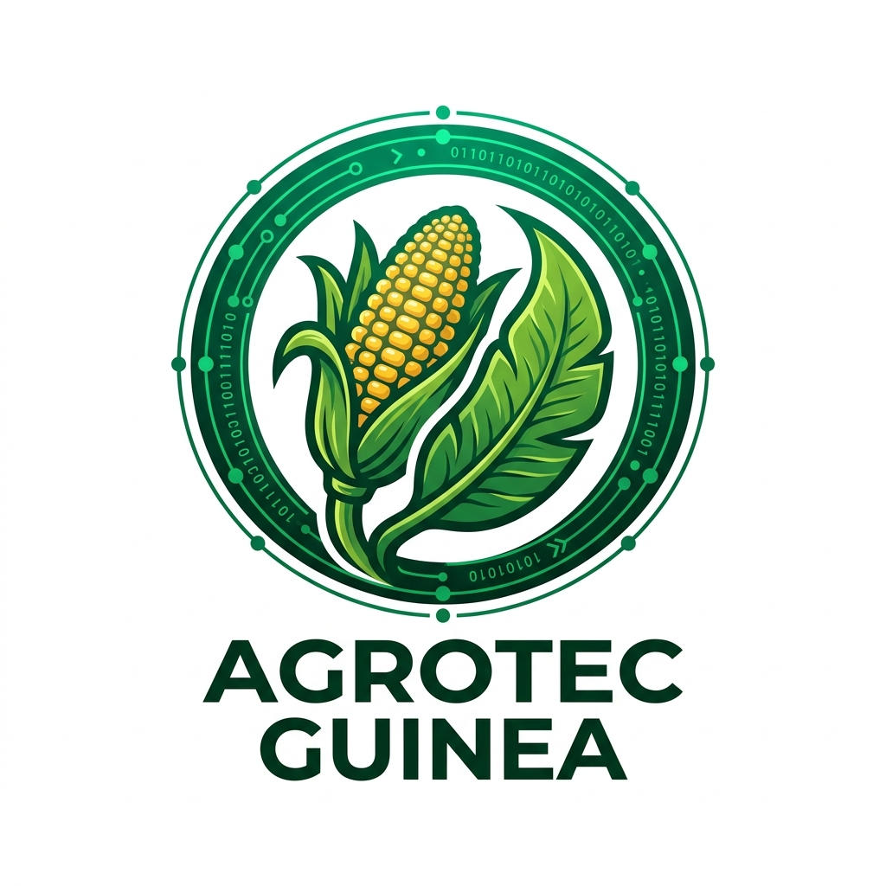

# AGROTEC GUINEA — Sistema de Diagnóstico Agrícola con IA

<div align="center">
  
  
  **Motor de IA: Groq LPU · Gemini AI · Offline-First**
  
  [](https://android.com)
  [](https://kotlinlang.org)
  [](https://groq.com)
  [](#)
</div>

---

## 🏆 Contexto Académico

**Proyecto:** II Foro Nacional de Inteligencia Artificial  
**Institución:** Universidad Afroamericana de África Central (AAUCA)  
**Categoría:** Solución IA para el Sector Primario  
**Fecha de presentación:** 14 de Mayo de 2026

## 👥 Equipo Desarrollador

| Nombre | Rol |
|--------|-----|
| Tranquilino Mba Ncogo Andeme | Lead Developer & AI Integration |
| Josefa | Backend & API Integration |
| María | UX/UI Designer & Frontend |

**Carrera:** Ingeniería de Sistemas — 4.º Año, AAUCA  
**País:** Guinea Ecuatorial

---

## 📱 Descripción del Producto

**AGROTEC GUINEA** es una aplicación Android de diagnóstico agrícola en tiempo real que utiliza modelos de visión por computadora alojados en la infraestructura **LPU (Language Processing Unit)** de Groq para identificar plagas en cultivos locales de Guinea Ecuatorial con una latencia inferior a **2 segundos**.

### 🎯 Problema que Resuelve

Los agricultores de Guinea Ecuatorial pierden entre el **20% y el 40%** de sus cosechas anuales por plagas no detectadas a tiempo. La escasez de técnicos agrónomos en zonas rurales y la falta de acceso a internet estable generan una brecha de conocimiento crítica. AGROTEC GUINEA democratiza el acceso al diagnóstico agronómico de calidad industrial.

---

## 🧠 Arquitectura de IA

### Pipeline de Diagnóstico Dual

```
📷 CameraX (Captura)
    └─► CameraAnalyzer (Resize 512x512 + JPEG 65% + Base64)
            └─► Groq LPU API (llama-4-scout-17b)
                    └─► JSON: {plaga, confianza, gravedad, tratamiento}
                            └─► Google Gemini 1.5 Flash
                                    └─► Consejo agronómico avanzado
                                            └─► Room DB (persistencia local)
                                                    └─► TTS Engine (voz en español)
```

### Modelos Utilizados

| Motor | Modelo | Función |
|-------|--------|---------|
| **Groq LPU** | `llama-4-scout-17b-16e-instruct` | Visión: Identificación visual de plagas |
| **Google Gemini** | `gemini-1.5-flash` | NLP: Consejos agronómicos contextualizados |
| **OpenWeatherMap** | REST API | Datos climáticos en tiempo real (Bata/Oyala) |

---

## 🌿 Cultivos y Plagas Soportadas

| Cultivo | Plagas Monitoreadas | Severidad |
|---------|-------------------|-----------|
| Plátano | Sigatoka Negra | 🔴 Alta |
| Maíz | Gusano Cogollero | 🔴 Alta |
| Yuca | Mosca Blanca, Ácaros Rojos | 🟡 Media |
| Tomate | Tizón Tardío, Mosca Minadora | 🔴 Alta |
| Cacao | Moniliasis | 🔴 Alta |
| Aguacate | Trips | 🟢 Baja |
| Caña de Azúcar | Barrenador del Tallo | 🟡 Media |
| Cacahuete | Aflatoxina (Aspergillus) | 🔴 Alta |

---

## 🏗️ Arquitectura del Sistema

```
com.agrotec.guinea/
├── api/
│   └── ApiClients.kt          # GroqApiClient, GeminiApiClient, WeatherApiClient
├── camera/
│   └── CameraAnalyzer.kt      # Procesamiento de imagen y compresión
├── data/
│   ├── AppDatabase.kt         # Room DB: Diagnoses, Treatments, MarketPrices
│   └── DatabaseSeeder.kt      # Precarga de 10 plagas + 9 precios 2026
└── ui/
    ├── SplashActivity.kt       # Pantalla de carga + animación
    ├── onboarding/
    │   └── OnboardingActivity.kt   # Términos y condiciones (primera vez)
    ├── MainActivity.kt         # Host con BottomNavigationView
    ├── scanner/
    │   └── ScannerFragment.kt  # Cámara + AI + TTS
    ├── history/
    │   └── HistoryFragment.kt  # Historial de diagnósticos (Room Flow)
    ├── market/
    │   └── MarketFragment.kt   # Precios de mercado 2026
    └── guides/
        └── GuidesFragment.kt   # Guías de tratamiento offline
```

### Patrón Arquitectónico: MVVM + Repository

- **UI Layer**: Fragments con ViewBinding + BottomNavigation (Navigation Component)
- **Domain Layer**: Coroutines + Kotlin Flow para asincronía
- **Data Layer**: Room Database (offline) + Retrofit (APIs remotas)

---

## 📊 Precios de Referencia 2026

| Cultivo | Precio XAF | Tendencia |
|---------|-----------|-----------|
| Maíz | 1,196 XAF/kg | ▲ Subiendo |
| Plátano | 603 XAF/racimo | ● Estable |
| Yuca | 450 XAF/kg | ▲ Subiendo |
| Tomate | 1,800 XAF/kg | ▲ Subiendo |
| Cacao | 4,500 XAF/kg | ▲ Subiendo |
| Café | 3,200 XAF/kg | ● Estable |

---

## 📱 Funcionalidades

| Módulo | Descripción | Online/Offline |
|--------|-------------|---------------|
| **Escáner IA** | Diagnóstico visual con marco profesional + línea animada | 🌐 Online |
| **Asistente de Voz** | TTS en español lee el diagnóstico completo | 📱 Local |
| **Historial** | Lista de todos los análisis realizados | 📱 Offline |
| **Mercado 2026** | Precios de referencia con tendencias | 📱 Offline |
| **Guías de Tratamiento** | 10 guías de plagas locales detalladas | 📱 Offline |
| **Clima en Tiempo Real** | Temperatura y humedad de Bata/Oyala | 🌐 Online |

---

## 🚀 Instalación

### Requisitos
- Android 8.0+ (API 26)
- Conexión a internet para diagnóstico con IA
- Cámara trasera

### Pasos
1. Descarga `AGROTEC_GUINEA_V4_FINAL.apk`
2. En tu teléfono: **Ajustes → Seguridad → Orígenes desconocidos → Activar**
3. Abre el archivo APK e instala
4. Lee y acepta los Términos y Condiciones
5. ¡Empieza a escanear cultivos!

---

## 🔧 Compilación desde Fuente

```bash
# Requisitos: Android Studio Hedgehog+, JDK 17, Android SDK 34
git clone https://github.com/TranquilinoCBA/AGROTEC-GUINEA.git
cd AGROTEC-GUINEA
./gradlew assembleDebug
# APK → app/build/outputs/apk/debug/app-debug.apk
```

---

## 📄 Licencia

**© 2026 Equipo AGROTEC GUINEA — AAUCA. Todos los derechos reservados.**

Desarrollado con fines académicos para el II Foro Nacional de IA en el Campus AAUCA, Guinea Ecuatorial. Queda prohibida la reproducción comercial sin autorización expresa del equipo.
