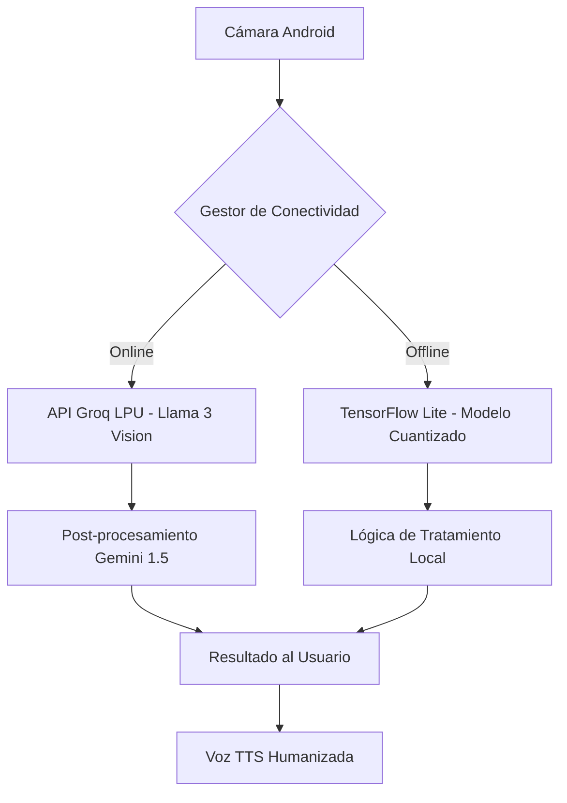

# Manual de Arquitectura Técnica — AGROTEC GUINEA v4.0

## 1. Introducción
Este documento detalla la arquitectura técnica del sistema **AGROTEC GUINEA**, desarrollado para el **II Foro Nacional de IA IndabaX GE 2026**. El sistema combina procesamiento en el borde (Edge Computing) con inferencia acelerada en la nube (LPU).

## 2. Diagrama de Arquitectura

## 3. Componentes de Software

### 3.1. Frontend Mobile (Android Native)
- **Lenguaje**: Kotlin 1.9
- **UI Framework**: Material Design 3 (M3) con Glassmorphism.
- **Cámara**: CameraX API con analizador de imagen en tiempo real.
- **Voz**: Android TextToSpeech (TTS) con calibración acústica para Guinea Ecuatorial.

### 3.2. Motor de Inteligencia Artificial (Dual Core)
- **Inferencia Nube**: Utiliza la arquitectura **LPU (Language Processing Unit)** de Groq para diagnósticos en < 2 segundos.
- **Inferencia Local**: Modelo de clasificación de imágenes optimizado (.tflite) para operación sin internet.

### 3.3. Landing Page (Ecosistema Digital)
- **Framework**: Next.js 14
- **Estética**: Bento Grid con animaciones Framer Motion.
- **3D**: Integración de Three.js para visualización de datos.

## 4. Gestión de Datos y Privacidad
- **Base de Datos**: Room (SQLite) para el historial de escaneos y precios de mercado.
- **Geolocalización**: Validación de perímetro para el Campus AAUCA (Djibloho).

## 5. Escalabilidad y Futuro
El sistema está diseñado para escalar horizontalmente mediante el uso de APIs distribuidas y puede integrarse con sensores IoT en el futuro para una agricultura de precisión total.

---
**© 2026 Equipo AGROTEC GUINEA — AAUCA.**
